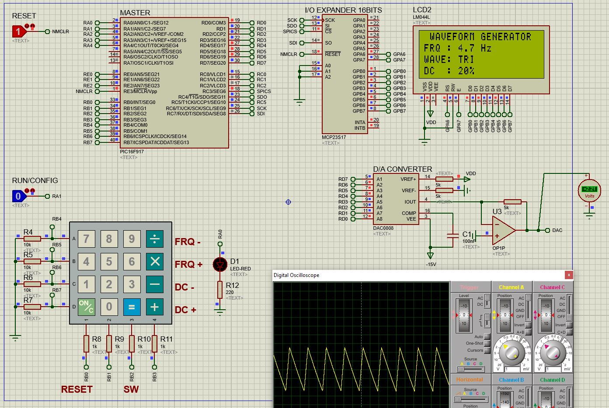

# Signal Generator (Assembly)
Signal waveform generator in Assembly language

School project consisting in the creation of an analogic signal waveform generator. The program allows to customize the signal type (square, ramp, sawtooth and triangle), the frequency and the duty cycle.

## Components 
* Microcontroller PIC16F917
* Digital-to-Analog Converter DAC0808
* LCD 20x4 LM044L
* I/O Expander 16 bits MCP23S17
* 16-Button Numeric Keypad

## Environment
* MPLABX v5.40
* Proteus 8

### Example

